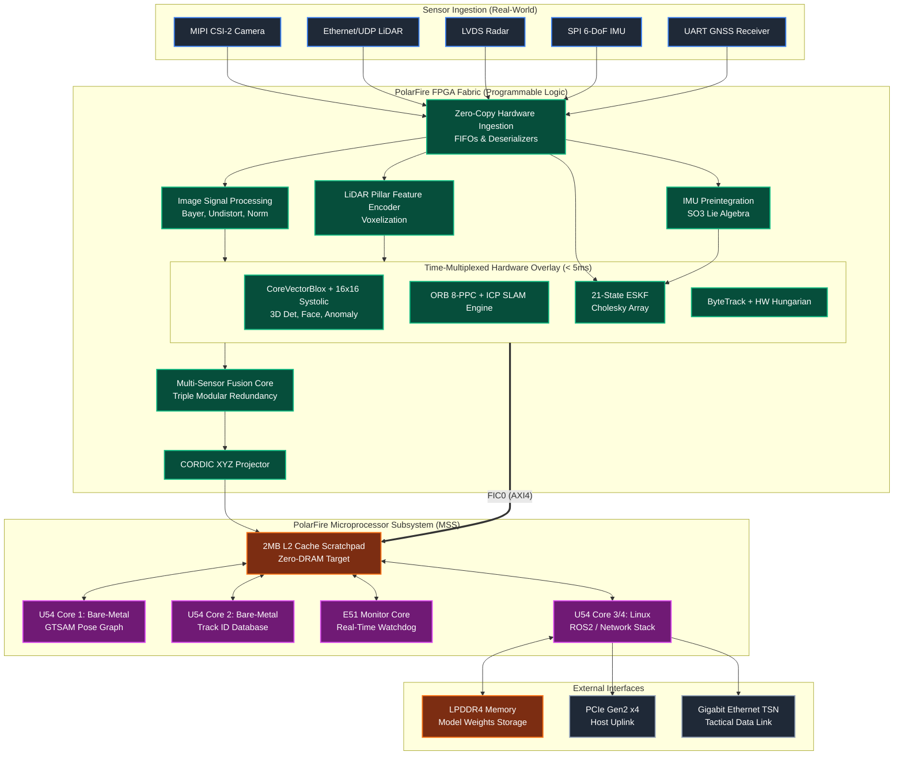

# AEGIS-NPU System Block Diagram

Here is the system block diagram for your proposal. You can include this directly in your markdown submission, or render it using any Mermaid viewer to generate an image for your final PDF/presentation.

