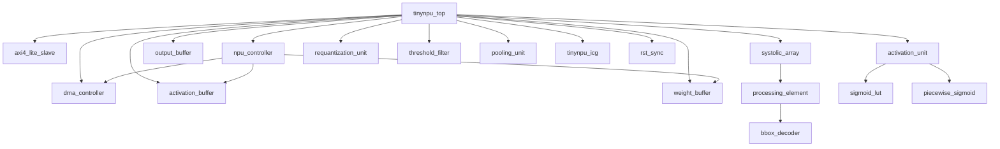

# Module Dependency Graph

```mermaid
graph TD
    top[tinynpu_top]
    axi_s[axi4_lite_slave]
    ctrl[npu_controller]
    dma[dma_controller]
    sys_arr[systolic_array]
    act_buf[activation_buffer]
    wgt_buf[weight_buffer]
    out_buf[output_buffer]
    act_unit[activation_unit]
    req[requantization_unit]
    thresh[threshold_filter]
    pool[pooling_unit]
    icg[tinynpu_icg]
    rst[rst_sync]

    top --> axi_s
    top --> ctrl
    top --> dma
    top --> sys_arr
    top --> act_buf
    top --> wgt_buf
    top --> out_buf
    top --> act_unit
    top --> req
    top --> thresh
    top --> pool
    top --> icg
    top --> rst

    sys_arr --> pe[processing_element]
    pe --> bbox[bbox_decoder]
    
    act_unit --> sig_lut[sigmoid_lut]
    act_unit --> p_sig[piecewise_sigmoid]

    ctrl --> act_buf
    ctrl --> wgt_buf
    ctrl --> dma
```
