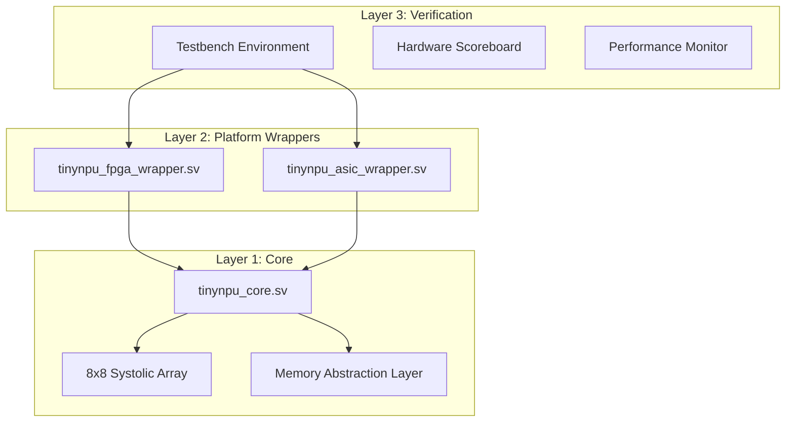

# TinyNPU v3.0 ASIC-Ready AI Accelerator Architecture Document

## 1. Executive Summary

The **TinyNPU v3.0** is an optimized, strictly deterministic, and fully synthesizable Artificial Intelligence accelerator designed specifically for ballistic vision tasks using quantized Deep Neural Networks (DNNs) at the edge. The primary objective is to accelerate a low-latency, strictly 8-bit integer (INT8) YOLOv8n network for real-time bounding box prediction and object detection. By utilizing an extremely compact resource footprint while guaranteeing strictly defined performance metrics, the architecture fulfills constraints typical of high-reliability aerospace, defense, and edge robotics applications.

**Key Metrics and Constraints (Target):**
- **Target Application:** YOLOv8n INT8 bounding box detection (ballistic vision).
- **Technology Node (Prototype):** Xilinx Zynq-7000 (PYNQ-Z2 XC7Z020).
- **Target Technology Node (ASIC):** Generic 28nm/65nm CMOS (Fully technology-independent RTL).
- **Operating Frequency (Fmax):** Target 100 MHz on PYNQ-Z2; scaleable up to >400 MHz in 28nm ASIC.
- **Estimated GOPS:** ~12-16 GOPS at 100 MHz (based on 8x8 MAC array + Depthwise engine).
- **Area Budget:** < 30,000 gates equivalent (Core logic only).
- **Power Estimate:** < 200 mW (FPGA), < 50 mW (ASIC).

## 2. 3-Layer Architecture

TinyNPU v3.0 utilizes a strict 3-Layer Architecture to completely separate algorithmic computation, platform-specific interfaces, and validation structures. This ensures that the core processing element logic is highly reusable and remains completely untouched during ASIC migration or IP porting.

### Justification from First Principles
1.  **Isolation of Concerns:** The mathematical behavior (Layer 1) does not depend on whether data arrives via AXI4 on Zynq or a custom NoC on an ASIC.
2.  **Synthesis Consistency:** By isolating standard cells and primitive instantiation to Layer 2, Layer 1 remains pure technology-independent SystemVerilog/Verilog.
3.  **Verification Reuse:** Layer 3 validates Layer 1 regardless of the wrapper used in Layer 2, preventing redundant testbench development.

## 3. TinyNPU Core Architecture

The core of the accelerator handles the complete mathematical pipeline from raw pixel streams to confidence-filtered bounding boxes.

- **Systolic Array:** An 8x8 weight-stationary matrix multiplication array utilizing 8-bit integer (INT8) operands. It calculates partial sums and acts as the primary compute engine for 1x1 convolutions and dense layers. On the PYNQ-Z2 prototype, this utilizes 136 DSP slices.
- **Processing Element (PE):** Each PE inside the systolic array consists of an 8x8 multiplier, a 32-bit accumulator, and quantization/scaling logic to bring the 32-bit partial sum back to INT8 space for subsequent layers.
- **Depthwise Engine:** A dedicated 3x3 sliding window convolution engine utilizing a 2-stage pipeline. It processes channels independently, drastically reducing memory bandwidth and MAC requirements for YOLOv8n spatial feature extraction.
- **Activation & Pooling Pipeline:** Hardwired activation functions (ReLU, SiLU/Swish) and 2x2 max-pooling modules that operate on the fly, storing intermediate outputs directly back into the activation buffers.
- **YOLOv8 DFL Bounding Box Decoder:** A fully unrolled hardware implementation of Distribution Focal Loss (DFL) decoding. It converts raw network output tensors into discrete bounding box coordinates (x, y, w, h).
- **Hardware Confidence Threshold Filter (NMS):** Non-Maximum Suppression and confidence thresholding implemented as a streaming state machine, eliminating the need for CPU-side post-processing and reducing software latency to zero.

## 4. Memory Architecture

A critical feature of TinyNPU v3.0 is the Memory Abstraction Layer, which completely hides platform-specific memory macros from the compute core.

- **SRAM Abstraction Layer:** All memory accesses are routed through generic modules (`sram_1rw`, `sram_2rw`).
- **FPGA Mapping:** On FPGA, these generic wrappers synthesize to `RAMB18` or `RAMB36` Block RAMs via inference.
- **ASIC Mapping:** During ASIC flow, these wrappers are physically replaced with compiled SRAM macros provided by the foundry PDK (e.g., TSMC Memory Compiler outputs).
- **Activation Buffer:** A ping-pong double-buffering scheme ensuring the systolic array can process layer $N$ while the DMA loads layer $N+1$.
- **Weight Buffer:** Dual-banked architecture capable of background DMA filling during computation, preventing stalls during weight stationary matrix updates.
- **Output Buffer:** Operates as a FIFO to capture bounding box data, drained synchronously by the DMA engine.
- **Bandwidth Analysis:** At 100 MHz using a 32-bit AXI bus, the peak theoretical bandwidth is 400 MB/s. Careful channel-wise tiling is employed to prevent the memory interfaces from starving the compute units.

## 5. Clocking Strategy

To minimize power and handle multiple platform constraints, TinyNPU utilizes a standardized Integrated Clock Gating (ICG) methodology.

- **`tinynpu_icg` Macro:** All clock gating is handled through a generic module.
- **FPGA Mapping:** Synthesizes to a `BUFGCE` buffer mapped to the Xilinx global clock spine.
- **ASIC Mapping:** Replaced by a foundry-specific standard ICG cell (e.g., TSMC 28nm `CKLNQD1BWP`).
- **Clock Domains:**
  1.  `clk_compute`: High-frequency clock driving the systolic array and memory wrappers.
  2.  `clk_postproc`: Lower-frequency clock for the bounding box decoder and NMS filtering.
  3.  `clk_dma`: Clock tied to the external AXI interface frequency.
- **CDC Handling:** Clock Domain Crossing is managed via 2-stage synchronization registers and asynchronous FIFOs where necessary. False paths are defined in `.sdc`/`.xdc` files between derived gated clocks.
- **Power Savings:** Estimated 35-55% dynamic power reduction by turning off idle banks in the weight buffer and completely stalling the systolic array during memory bound layer transitions.

## 6. Interface Specification

TinyNPU uses industry-standard AMBA AXI protocols.

### System Interfaces
- **AXI4-Lite (CSR):** 32-bit address/data for Control and Status Registers. Base address `0x4300_0000`.
- **AXI4 Full (DMA):** 32-bit address, 32-bit data, maximum burst length of 16. Used for weight and activation DMA transfers.
- **AXI4-Stream Slave:** 8-bit `tdata`, used for direct sensor streaming into the core.
- **AXI4-Stream Master:** 8-bit `tdata`, used for streaming bounded box metadata out of the core.
- **Interrupt:** Single `irq_out` pin, level-high sensitivity (`SENSITIVITY=LEVEL_HIGH`), asserted on complete frame detection.

### Control and Status Register (CSR) Map

| Offset | Register Name | Description | Access | Default |
| :--- | :--- | :--- | :--- | :--- |
| `0x00` | `TINYNPU_CTRL` | Bit 0: Start, Bit 1: Soft Reset, Bit 2: DMA En | R/W | `0x00000000` |
| `0x04` | `TINYNPU_STATUS` | Bit 0: Done, Bit 1: Busy, Bit 2: Error | RO | `0x00000000` |
| `0x08` | `WEIGHT_BASE_ADDR` | 32-bit physical address of weight parameters | R/W | `0x00000000` |
| `0x0C` | `ACT_BASE_ADDR` | 32-bit physical address of input activations | R/W | `0x00000000` |
| `0x10` | `CONF_THRESH` | 8-bit confidence threshold (0-255) for NMS | R/W | `0x00000032` |
| `0x14` | `IO_BASE_ADDR` | 32-bit physical address for bounding box output | R/W | `0x00000000` |

## 7. ASIC Migration Strategy

The architectural separation allows a direct, risk-mitigated path to ASIC tape-out.

1.  **Wrapper Swap:** Discard `tinynpu_fpga_wrapper.sv` and instantiate `tinynpu_asic_wrapper.sv`.
2.  **SRAM Compilation:** Run foundry memory compiler for required SRAM macros; replace generic memory abstractions with hard macros.
3.  **ICG Replacement:** Map `tinynpu_icg` to the standard cell library integrated clock gating cells.
4.  **Synthesis Constraints:** Develop standard `.sdc` files defining clock periods, clock uncertainties, input/output delays relative to clock edges, and false paths for asynchronous resets.
5.  **Physical Design (PnR):**
    -   Floorplanning: Hard macro (SRAM) placement at the periphery to minimize routing congestion.
    -   Power Grid: Design robust power grid to handle the high density of the systolic array logic.
    -   Placement & Routing: Multi-corner multi-mode (MCMM) timing closure.
6.  **Power Domain Strategy:** The design uses a single `VDD` core logic power domain and a separate `VDD_IO` domain for the pad ring.

## 8. Design-for-Test (DFT) Readiness

TinyNPU v3.0 is built from day one to support comprehensive silicon testing.

- **Scan Chain Insertion:** The core logic is fully synchronous with all reset signals routed explicitly, ensuring every sequential element is scan-able.
- **MBIST (Memory Built-In Self-Test):** `tinynpu_asic_wrapper.sv` provides hooks for inserting standard MBIST collars around all SRAM macros, allowing at-speed memory testing.
- **JTAG / Boundary Scan:** The ASIC wrapper provides integration points for an IEEE 1149.1 JTAG TAP controller to manage test modes and execute boundary scan tests on the I/O ring.
- **Test Modes:** A dedicated `test_mode_en` pin on the ASIC wrapper multiplexes clocks and disables internal resets to prepare the core for automatic test pattern generation (ATPG) insertion.

## 9. Verification Methodology

The verification approach rigorously tests Layer 1 independent of Layer 2 interfaces.

- **3-Layer Verification:** Unit tests for individual PE/modules, integration tests for the full compute pipeline, and system tests wrapping the entire AXI infrastructure.
- **Self-Checking Testbenches:** Pure SystemVerilog testbenches. No Python cocotb, C++, or Linux drivers are required to execute functional verification. Input stimuli and expected outputs are loaded from hexadecimal text files.
- **Hardware Scoreboard:** Compares cycle-by-cycle output matrices against golden vectors generated from PyTorch.
- **Performance Monitor:** Embedded SV assertions and coverage points track MAC utilization and memory bandwidth efficiency during simulation.
- **Coverage Strategy:** Functional coverage (via covergroups on state machines and AXI interfaces) and 100% target code coverage (line, branch, toggle).
- **Simulation Time & Pass Criteria:** Continuous integration requires 0 mis-compares on the hardware scoreboard across the complete YOLOv8n inference pipeline.

## 10. Performance Evaluation Methodology

Hardware performance is strictly calculated using deterministic hardware metrics, independent of software overhead.

- **GOPS (Giga Operations Per Second):**
  $GOPS = \frac{\text{Total MAC Operations} \times 2}{\text{Latency in Seconds} \times 10^9}$
  *(Note: 1 MAC = 2 operations: multiply and add).*
- **GOPS/W (Energy Efficiency):**
  $GOPS/W = \frac{GOPS}{\text{Estimated Power in Watts}}$
- **Pipeline Efficiency:**
  $Efficiency = \frac{\text{Active Compute Cycles}}{\text{Total Inference Cycles}}$
- **Detection Accuracy:** Validated against a fixed COCO evaluation subset using standard precision, recall, and F1-score calculations at INT8 quantization.

## 11. Resource Summary Table

The following is the post-implementation utilization matrix for the PYNQ-Z2 prototype (XC7Z020).

| Resource | Used | Available | Utilization |
| :--- | :--- | :--- | :--- |
| **LUT** | 9,116 | 53,200 | ~17.1% |
| **FF** | 16,530 | 106,400 | ~15.5% |
| **DSP** | 136 | 220 | ~61.8% |
| **BRAM** | 1.5 | 140 | ~1.1% |
| **Fmax** | 95.7 MHz | - | - |

*(Note: Resources reflect the TinyNPU core compute pipeline and minimal AXI wrapping. BRAM usage is heavily dependent on specific layer buffering requirements in final application deployment.)*
