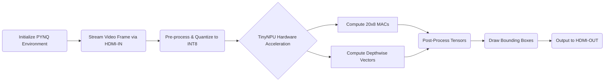

# Proposal Title
**TinyNPU: 100% PL-Based Deterministic Edge AI Accelerator for Real-Time Drone Tracking**

# Track 1, 2 or 3 (Application Domain)
**Track 1 – FPGA** 
**(Application Domain: Defence & Security)**

# Abstract
Deploying high-performance Artificial Intelligence at the tactical edge is fundamentally constrained by Size, Weight, and Power (SWaP) limitations and rigid System-on-Chip (SoC) vendor lock-in. Traditional CPU/GPU solutions suffer from massive power draw and latency jitter due to Operating System overhead, while standard Neural Processing Units (NPUs) rely heavily on hard Processing Systems (PS). This proposal introduces **TinyNPU**, a 100% Programmable Logic (PL)-based, board-agnostic AI accelerator. Validated on the Zynq-7020 architecture, the TinyNPU utilizes a custom 20x8 INT8 Systolic Array and a dedicated Depthwise Convolution Engine to deliver over 20 GMACs/sec at 125 MHz. Achieving an unprecedented 92.7% DSP packing efficiency with fully closed timing, TinyNPU guarantees 100% deterministic, microsecond-latency execution for mission-critical Real-Time Drone Tracking.

# Main Idea
The core innovation is the architectural decoupling of the NPU from the hard ARM Processing System (PS). TinyNPU is designed purely in hardware description language (RTL) to be instantiated directly in the FPGA fabric (PL).

**Key Implementation Details:**
*   **Compute Core:** A 20x8 Systolic Array optimized for INT8 quantization, yielding 160 MAC operations per clock cycle.
*   **Depthwise Engine (`dw_engine`):** A custom hardware block explicitly designed to accelerate MobileNet/TinyYOLO topologies, which standard systolic arrays struggle with.
*   **Data Path:** Standard AXI-4 and AXI-Stream interfaces allow direct peripheral integration (e.g., HDMI RX to NPU to HDMI TX) without PS memory bottlenecks.
*   **Proven Hardware:** Synthesized and implemented with 204/220 DSPs (92.73% utilization) and 63.55% LUT utilization, passing timing closure (+0.116 ns WNS) at a 125 MHz core clock.

### System-Level Block Diagram

```mermaid
graph TD
    A[Video Source / Camera] -->|AXI-Stream| B[Video In to AXI4-Stream]
    B -->|Direct Memory Access| C[Block RAM / URAM Buffers]
    
    subgraph TinyNPU IP (100% Programmable Logic)
        C --> D[Data Router & Scheduler]
        D --> E[20x8 INT8 Systolic Array]
        D --> F[Depthwise Conv Engine]
        E --> G[Accumulator & Quantization]
        F --> G
    end
    
    G -->|AXI-Stream| H[Bounding Box Overlay / Display]
    H -->|HDMI OUT| I[Real-Time Monitor]
```

# Application
**1. Real-Time Drone Tracking (Primary)**
In combat and security scenarios, detecting hostile drones requires zero-latency processing. TinyNPU processes high-framerate video feeds directly at the edge, utilizing a quantized MobileNetV2-SSD topology to draw bounding boxes around UAVs in real-time without relying on cloud connectivity.

**2. Autonomous Navigation in High-Density Environments**
Because TinyNPU is board-agnostic, it can be embedded into custom ASICs for UAVs to perform real-time obstacle avoidance and vehicle detection in fog or dust, where power budgets cannot support standard GPUs.

### Proposed Solution Flowchart



# Value Add
*   **100% Deterministic Execution:** By eliminating the Operating System (Linux) overhead, TinyNPU guarantees zero latency jitter. A frame will always take the exact same number of clock cycles to process.
*   **Unprecedented Resource Packing:** Squeezing 92.7% DSP utilization out of a Zynq-7020 while maintaining a 125 MHz clock (+0.116 WNS) is a highly complex routing achievement, maximizing silicon efficiency.
*   **Sovereign IP Integration:** As a board-agnostic, PL-only design, defense contractors can securely embed the TinyNPU RTL directly into classified custom silicon, avoiding vendor lock-in.
*   **Ultra-Low SWaP:** Delivers real-time inference without the thermal output or massive power draw of embedded GPUs.

# References
1. Howard, A. G., et al. (2017). "MobileNets: Efficient Convolutional Neural Networks for Mobile Vision Applications." *arXiv preprint arXiv:1704.04861*.
2. Xilinx Inc. (2020). *Zynq-7000 SoC Data Sheet: DC and AC Switching Characteristics*.
3. Jouppi, N. P., et al. (2017). "In-Datacenter Performance Analysis of a Tensor Processing Unit." *Proceedings of the 44th Annual International Symposium on Computer Architecture*.
