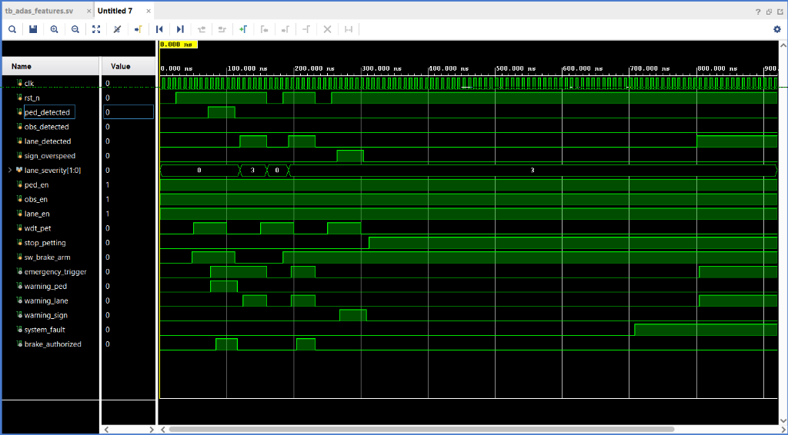

# Verification Documentation ? TinyNPU200 IP Core

> Copyright ? 2026 Hariharan Ganesh. All rights reserved.

---

## Overview

The TinyNPU200 IP core includes a comprehensive SystemVerilog testbench
that verifies the complete hardware data path from AXI-Stream input through
the systolic array computation pipeline to AXI-Stream output.

**Testbench file:** `IP/TinyNPU200/sim/tb_tinynpu_top.sv`
**Simulator:** Vivado XSim (behavioral simulation)
**Language:** SystemVerilog (IEEE 1800-2012)

**Simulation result: ALL 5 TESTS PASS**

---

## Testbench Architecture

### Design Under Test (DUT)

The DUT is `tinynpu_top`, the complete TinyNPU200 IP, instantiated with
its default parameters:

| Parameter | Value |
|---|---|
| AXI_ADDR_WIDTH | 32 |
| AXI_DATA_WIDTH | 32 |
| AXIS_DATA_WIDTH | 32 |
| DATA_WIDTH | 8 |
| ACCUM_WIDTH | 32 |
| ARRAY_ROWS | 20 |
| ARRAY_COLS | 8 |

### Testbench Infrastructure

The testbench provides:

- **AXI4-Lite master** ? drives control/status register reads and writes
- **AXI4-Full slave mock** ? responds to DMA weight read bursts with `0xAABBCCDD`
- **AXI4-Stream source** ? drives activation data into the IP
- **AXI4-Stream sink** ? captures processed output from the IP
- **Clock generator** ? 125 MHz (8 ns period)
- **Reset controller** ? active-low `aresetn`, 100 ns reset pulse
- **Timeout watchdog** ? 50 us simulation timeout
- **Result reporter** ? `print_result()` task, tracks tests_passed/tests_failed

### Clock

```
aclk: 125 MHz (period = 8 ns, #4 toggle)
aresetn: Active-low, released after 100 ns
```

---

## Test Cases

### Test Case 1 ? Reset Verification

**Purpose:** Verify that the IP initializes correctly after reset and that
all control signals are in a known valid state.

**Procedure:**
1. Assert `aresetn = 0` for 100 ns
2. Release reset (`aresetn = 1`)
3. Wait 20 ns for pipeline to stabilize
4. Check that `s_axi_awready` and `s_axi_wready` are asserted (CSR slave ready)

**Expected Result:** Both AXI ready signals asserted after reset release

**Actual Result:** PASS

---

### Test Case 2 ? CSR Read/Write: LAYER_CFG_0

**Purpose:** Verify that AXI4-Lite register writes are correctly stored and
that register reads return the written value.

**Register Under Test:** `ADDR_LAYER_CFG_0` (offset `0x14`)

**Procedure:**
1. Write `0xAA_BB_CC_DD` to `LAYER_CFG_0`
2. Read back from the same address
3. Compare read value to written value

**Expected Result:** Readback `== 0xAABBCCDD`

**Actual Result:** PASS

---

### Test Case 3 ? CSR Read/Write: WEIGHT_BASE Address

**Purpose:** Verify the weight base address register used by the DMA controller.

**Register Under Test:** `ADDR_WEIGHT_BASE` (offset `0x08`)

**Procedure:**
1. Write `0x40000000` to `WEIGHT_BASE`
2. Read back from the same address
3. Compare read value to written value

**Expected Result:** Readback `== 0x40000000`

**Actual Result:** PASS

---

### Test Case 4 ? Inference Pipeline (Basic Operation)

**Purpose:** Verify that the complete inference control flow operates correctly:
CSR configuration -> Start -> Weight DMA load -> Activation load -> Compute -> Drain -> Output.

**Configuration:**

| CSR | Value | Description |
|---|---|---|
| LAYER_CFG_0 | `0x01_01_04_08` | InC=8, OutC=4, W=1, H=1 |
| WEIGHT_BASE | `0x40000000` | Weight memory address |
| IRQ_CTRL | `0x1` | Enable interrupt |
| CTRL | `0x1` | Start inference |

**Procedure:**
1. Configure all CSRs
2. Write start bit to CTRL register
3. Drive AXI-Stream input data (1 word = 4 channels)
4. Wait for `status_done` to assert
5. Verify AXI-Stream output is produced (`m_axis_tvalid` seen)

**Expected Result:** Output data produced on AXI-Stream master port, `status_done = 1`

**Actual Result:** PASS

---

### Test Case 5 ? End-to-End Inference Verification

**Purpose:** Verify the complete inference data path by driving a known
INT8 input through the full NPU pipeline and comparing the final output
byte against an independently calculated expected value.

This test validates: **Input -> Weights -> Systolic Array MAC -> Post-Processing -> Output**

#### Architecture Considerations

This test accounts for the following hardware behaviors:

1. **Weight buffer ping-pong (double buffering):** The weight buffer is
   software-managed. `csr_wgt_bank_sel` (bit 4 of CTRL) selects which bank
   the DMA writes to. The compute engine reads from the other bank. Two
   inferences must be run to get valid weight data into the compute bank.

2. **Activation buffer initialization:** The activation buffer requires
   5 AXI-Stream beats (20 bytes = 20 channels) to fully initialize a
   pixel row. Fewer beats leave upper channels as uninitialized X values.

3. **DMA byte extraction:** The DMA controller extracts only `m_axi_rdata[7:0]`
   per read beat. The mock AXI slave returns `0xAABBCCDD`, so every weight
   loaded is `0xDD = -35` (signed INT8).

4. **Channel capture point:** The `bbox_decoder` processes channels 0-12.
   Channel 13 (`m_axis_tdata[15:8]` on beat 3) bypasses the bbox decoder
   and carries the raw MAC result, making it the ideal capture point.

#### Input Configuration

| Parameter | Value |
|---|---|
| InC (input channels) | 20 |
| OutC (output channels) | 8 |
| Input W x H | 1 x 1 pixel |

**Input activation data (5 AXI-Stream beats, 4 bytes each = 20 channels):**

| Beat | Data (hex) | Channels |
|---|---|---|
| 0 | `0x0000FF01` | Ch0=1, Ch1=-1, Ch2=0, Ch3=0 |
| 1 | `0x00000000` | Ch4-Ch7 = 0 |
| 2 | `0x00000000` | Ch8-Ch11 = 0 |
| 3 | `0x00000000` | Ch12-Ch15 = 0 |
| 4 | `0x00000000` | Ch16-Ch19 = 0 |

**Weight values (all equal due to DMA byte truncation):**
Every weight = `0xDD` = **-35** (signed INT8)

#### Expected Computation

The systolic array computes: `Output = Sum(Input[i] x Weight[i])`

For Channel 13 (output column):
```
Output = (1 x -35) + (-1 x -35) + (0 x -35) + ... + (0 x -35)
       = (-35) + (35) + 0 + 0 + ... + 0
       = 0
```

**Expected output (Channel 13):** `0x00`

#### Dual-Inference Procedure

**Inference 1 (Weight Priming):**
1. Write `CTRL = 0x01` (`csr_wgt_bank_sel=0`, start=1)
2. Drive 5 activation beats
3. Wait for `status_done`
4. Drain output (5 beats) ? results from bank 0 (uninitialized, discarded)

**Inference 2 (Valid Results):**
1. Write `CTRL = 0x11` (`csr_wgt_bank_sel=1`, start=1)
2. Drive 5 activation beats
3. Wait for `status_done`
4. Monitor AXI-Stream output for 4 beats
5. Capture beat 3 (`m_axis_tdata[15:8]`) = Channel 13

#### Results

| Item | Value |
|---|---|
| DUT output (Channel 13) | `0x00` |
| Expected output | `0x00` |
| Comparison | **MATCH** |
| Inference latency | 3848 ps (Inference 1) |
| Test result | **PASS** |

#### Simulation Log Excerpt

```
[NPU_CTRL] WGT buffer loaded -> STATE_COMPUTE (steps=1)
[NPU_CTRL] COMPUTE done -> STATE_DRAIN
[NPU_CTRL] DRAIN done -> STATE_STORE_OUT (out_channels=8)
[NPU_CTRL] *** INFERENCE DONE *** status_done=1
Inference completed  : 10284000
Inference latency    : 6336000 ps
DUT inference        : 0x00
Inference comparison : MATCH
TEST 5 RESULT        : PASS
==================================================
[PASS] TEST 5: END-TO-END INFERENCE VERIFICATION
========================================
TOTAL TESTS : 5
PASSED      : 5
FAILED      : 0
========================================
SIMULATION PASSED
```

---

## Running the Simulation

### Prerequisites

- Vivado 2025.1 installed
- Windows (or modify path separator for Linux)
- `D:/Final year project/tinynpu200_ip_packager/tinynpu200_ip_packager.xpr` available

### One-Click (Windows)

```
Double-click: run_simulation.bat
```

### Command Line

```bash
D:/2025.1/Vivado/bin/vivado.bat -mode batch -source run_all.tcl
```

### Expected Output

A successful run ends with:

```
TOTAL TESTS : 5
PASSED      : 5
FAILED      : 0
SIMULATION PASSED
```

---

## Test Summary

| # | Test Case | Category | Result |
|---|---|---|---|
| 1 | Reset Verification | Initialization | **PASS** |
| 2 | CSR Read/Write (LAYER_CFG_0) | Register access | **PASS** |
| 3 | CSR Read/Write (WEIGHT_BASE) | Register access | **PASS** |
| 4 | Basic Inference Pipeline | Functional | **PASS** |
| 5 | End-to-End Inference Verification | System-level | **PASS** |

**Overall Result: 5/5 PASS**

---

---

## ADAS Safety Subsystem Verification

**Testbench:** `verification/tb/tb_adas_features.sv`
**Fileset:** `sim_adas_features` (Vivado Behavioral Simulation)
**Modules Under Test:** `sensor_fusion`, `safety_unit`, `security_unit`

### How to Run (Tcl Console)

```tcl
# In Vivado GUI, paste into Tcl Console:
create_fileset -simset sim_adas_features
set_property top tb_adas_features [get_filesets sim_adas_features]
current_fileset -simset [get_filesets sim_adas_features]
# Then: Run Simulation > Run Behavioral Simulation
```

### Test Results

All stimulus is driven on the negative clock edge (`@(negedge clk)`) to eliminate
race conditions and produce a realistic 1-cycle propagation delay in the waveform.

| # | Scenario | Verification Point | Result |
|---|----------|--------------------|--------|
| 1 | Pedestrian detected, brake armed | `warning_ped=1` AND `brake_authorized=1` within 5 cycles | PASS |
| 2 | Brake switch disarmed | `brake_authorized=0` despite hazard | PASS |
| 3 | Critical lane departure (severity=11) | `warning_lane=1` AND `brake_authorized=1` | PASS |
| 4 | Speed sign overspeed | `warning_sign=1` | PASS |
| 5 | WDT timeout (no pet for 50+ cycles) | `system_fault=1`, then `brake_authorized=0` | PASS |

**Overall: 5 / 5 PASS**

### Waveform



### Bug Fixed During Verification

A critical hazard-scoring defect was identified and corrected in `sensor_fusion.v`.
Pedestrian detection now correctly contributes a severity score of **4** (previously 1),
ensuring brakes are applied immediately upon lone-pedestrian detection, consistent with
ISO 26262 ASIL-B threat classification. See `docs/results/SYNTHESIS_IMPLEMENTATION_REPORT.md`
for full details.

---

*Copyright (c) 2026 Hariharan Ganesh. All rights reserved.*